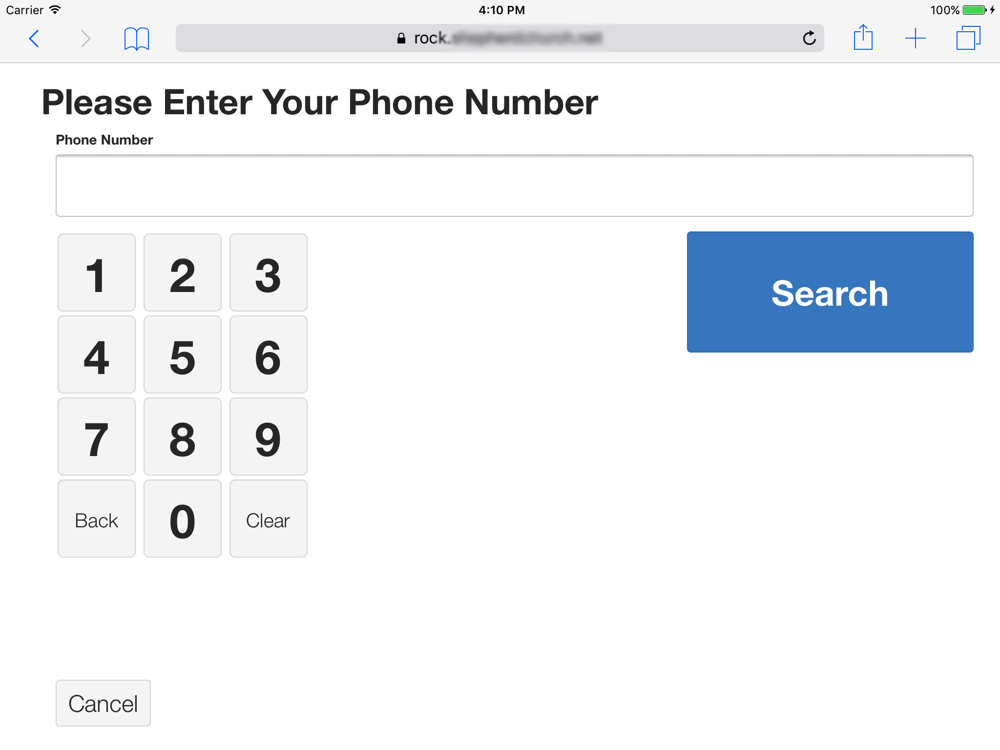
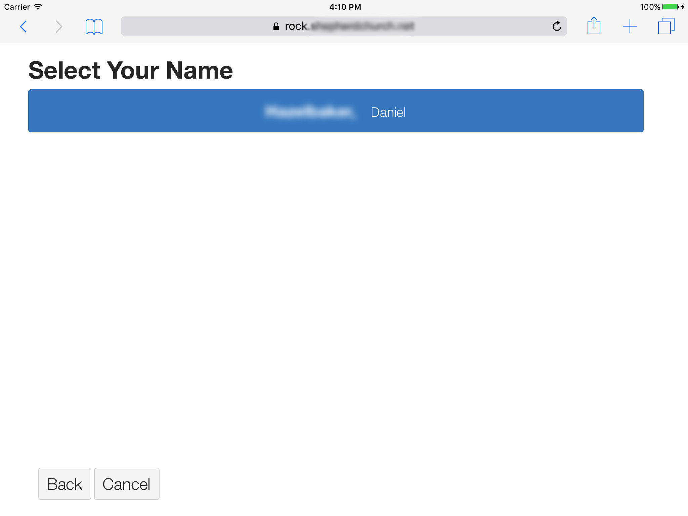

# Blocks

## Cache And Redirect

#### Introduction

This is meant to be used to cache a value from the query string and then
forward the user to another page with the same query string parameter. Upon
return to this same page containing the Cache And Redirect block without
the specified query string parameter it will use the value stored in the
cache and again redirect to the target page. If no value is supplied in the
query string and no value is availabe in the cache then the user is
redirected to another page that would, normally, be used to pick the value
for the query string parameter.

#### Use Cases

You have a number of iPads or laptops for the public to use to sign up for
various bits of information, groups, etc. But you do not know which device
will end up at which table so you cannot hard code the home URL to the
correct destination. You can instead create a Configure page that has
buttons that link to the Cache page with the correct query string parameter
defined. The Cache page will store this and send the user on to the Action
page where they can do whatever you want them to do. When the action is
finished they are sent back to the Cache page which will check the cache
and send them back to the Action page with the correct query string
parameter.

#### Configuration

**Setup Page** is the page that the user will be redirected to if there
is currently no cached value and one was not specified in the query string.

**Content Page** is the page the user will be redirected to with the proper
query string parameter, assuming we have a value in cache or have been
given on in our own query string.

**URL Key** is the key that is expected on our query string (or loaded
from cache) and passed to the **Content Page**.

**Cache Time** is the duration in minutes to keep the **URL Key** value
in cache before it is expired. This is a rolling duration, meaning that
each time the value is read from cache the expiration time is extended.

**Session Unique** is a boolean that indicates if you want this to be
session specific or page (block) specific. If *true* then the cache entry
will be unique to each user's session. If *false* then the cache entry
will be shared by all user's visiting this page.

**Block Key** allows you to link multiple blocks on different pages
together. If a value is entered here then all blocks using this same
**Block Key** and **URL Key** will share the same cached value. Leave blank
for unique cached values on each block.

#### Usage

The normal usage will be 3 pages.

* `Page A` - this is the page where the user will select the initial cache
key.
* `Page B` - this is the page that contains this block.
* `Page C` - this is the (initial) page that will peform whatever
tasks you want the user to do.

`Page A` should link to `Page B` with the appropriate key specified in
the query string. `Page B` will then link to `Page C` after storing the
value in cache. Once `Page C` is done doing whatever it needs to do it
links back to `Page B`, which then checks the cache and sends them back
to `Page C` automatically. If it has been more than **Cache Time** minutes
since it was last visited, causing the cached value to expire, then the
user is sent to `Page A` instead.

## Self Serve Search (Kiosk)

#### Introduction

Self Serve Search is meant to be used on a kiosk where you want the user
to search for themselves (usually by phone number) the same way they would
to check-in one of their kids. Instead of performing a particular action
it simply redirects the user to your selected page with a query string
parameter appending to the URL to identify the user (either by Id or Guid).
This then allows you to chain to another module to perform the specific
action you want to on that person.

#### Use Cases

You have a kiosk in your lobby where the user can give, update their
record, etc. You also want them to be able to sign up for a mailing list
without having to enter their username and password (or create a new account
if they do not already have one). Use this module to let them search for
themselves and pass their PersonId to the next page as a query string
parameter. This allows you to identify the user without them to do a full
login.

#### Sample Images

**Search By Phone**

**Person Select**

#### Configuration

**Cancel Page** is the page to direct the user to if they click the
cancel button.

**Continue Page** is the page to direct the user to if they sleect their
person record.

**Use Person GUID** will pass the Person GUID rather than the ID number if
set to true.

**Query String Key** is the key to use when passing the Person ID/GUID to
the **Continue Page**.

**Search Type** is the type of search method to use, either *Phone* or
*Name*.

**_Phone Search_**

**Minimum Length** is the minimum number of digits the user must enter
to perform a search by phone number.

**Maximum Length** is the maximum number of digits the user may enter
when performing a search by phone number.

**_Name Search_**

**Minimum Length** is the minimum number of letters the user must enter to
perform a search by name.
